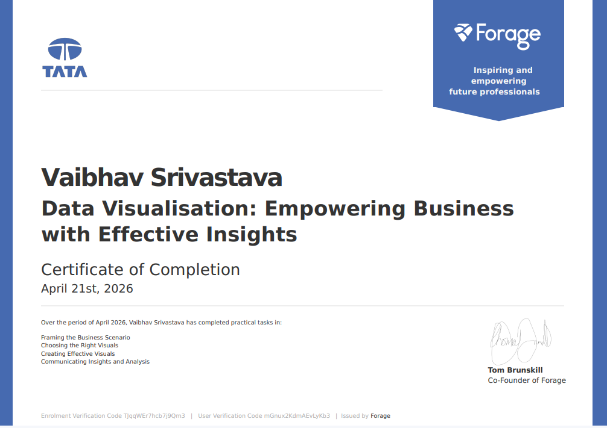

# tata-data-visualisation-job-simulation

# TATA Data Visualisation: Empowering Business with Effective Insights

## 📌 Overview

Completed the TATA Data Visualisation job simulation through Forage, focusing on data-driven business analysis, visualization and communicating insights to business stakeholders.

## 🎯 Business Context

The simulation involved analyzing business requirements from a leadership perspective and translating data into effective visualizations and actionable insights.

## 🛠️ Skills & Tools

- Power BI
- Data Visualization
- Data Analysis
- Data Cleaning
- Business Analysis
- Data Interpretation
- Data Storytelling
- Stakeholder Communication

## 📋 Tasks Completed

### 1. Framing the Business Scenario
Identified key questions that business leaders such as the CEO and CMO would require data to answer.

### 2. Choosing the Right Visuals
Selected appropriate visualization techniques based on the business questions and intended audience.

### 3. Creating Effective Visuals
Developed visualizations to communicate relevant patterns and findings from the data.

### 4. Communicating Insights
Presented findings and translated analytical results into business-oriented insights and recommendations.

## 📜 Certificate

## 🎯 Key Learning

Learned how to approach analytics from a business stakeholder perspective and communicate data insights clearly rather than focusing only on technical visualization.
